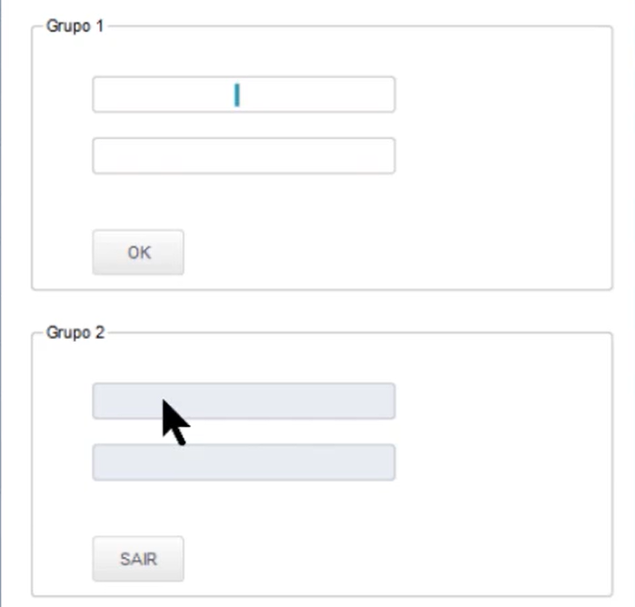

## TGroup

---

- [Caixa de marcação que fica em volta de tudo](#caixa-de-marcação-que-fica-em-volta-de-tudo)
- [Componentes utilizados](#componentes-utilizados)
  - [`TDialog`](#tdialog)
  - [`TGroup`](#tgroup-1)
  - [`TGet`](#tget)
  - [`TButton`](#tbutton)
- [Função passada para o botão](#função-passada-para-o-botão)
- [Bloco utilizado no TGet](#bloco-utilizado-no-tget)
  - [O que é `u`?](#o-que-é-u)
  - [O que é `PCount()`?](#o-que-é-pcount)
- [Métodos utilizados](#métodos-utilizados)
  - [`Activate()`](#activate)
  - [`End()`](#end)
  - [`Refresh()`](#refresh)

---

### Caixa de marcação que fica em volta de tudo

{ width=320px }


**Documentação** - https://tdn.totvs.com/display/tec/TGroup


No exemplo `zTGroup.prw` são demonstrados:
- Criação de dois grupos.
- Uso de `New()` e `Create()`.
- Organização dos Gets.
- Atualização de campos utilizando `Refresh()`.
- Botões dentro da janela.

---

## Componentes utilizados

### `TDialog`

Janela principal onde todos os componentes são exibidos.

---

### `TGroup`

Cria uma caixa com título para organizar os componentes da tela.

---

### `TGet`

Campo utilizado para entrada ou exibição de dados.

---

### `TButton`

Botão responsável por executar alguma ação quando clicado.

---

## Função passada para o botão

```advpl
{ || EnviarGets() }
```

É um **bloco de código (CodeBlock)**.

Quando o botão é clicado, esse bloco é executado e chama a função:

```advpl
EnviarGets()
```

Outro exemplo:

```advpl
{ || oDlg:End() }
```

Ao clicar no botão, a janela é fechada.

---

## Bloco utilizado no TGet

```advpl
{|u| IIF(Pcount()>0, cGet2 := u, cGet2)}
```

Esse bloco controla a leitura e escrita do campo.

Quando o usuário digita:

```advpl
cGet2 := u
```

Quando o sistema apenas precisa mostrar o valor:

```advpl
cGet2
```

### O que é `u`?

É o valor recebido pelo `TGet`.

### O que é `PCount()`?

Retorna a quantidade de parâmetros recebidos pela função.

No `TGet` normalmente:

- `PCount() > 0` → está gravando um novo valor.
- `PCount() = 0` → está apenas lendo o valor da variável.

---

## Métodos utilizados

### `Activate()`

Exibe a janela (`TDialog`) para o usuário.

### `End()`

Fecha a janela aberta.

### `Refresh()`

Atualiza visualmente o componente na tela após alterar seu valor.

---
