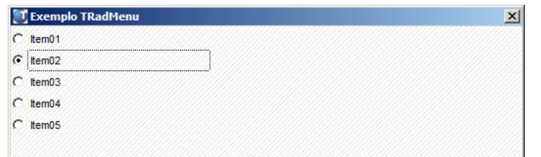

## TRadMenu

### Documentação - https://tdn.totvs.com/display/tec/TRadMenu

```
TRadMenu():New( [ nRow ], [ nCol ], [ aItems ], [ bSetGet ], [ oWnd ], [ uParam6 ], 
    [ bChange ], [ nClrText ], [ nClrPane ], [ cMsg ], [ uParam11 ], [ bWhen ], 
    [ nWidth ], [ nHeight ], [ bValid ], [ uParam16 ], [ uParam17 ], [ lPixel ], 
    [ lHoriz ], [ lAutoHeight ] )
```

```
User Function TRadMenu()
  DEFINE DIALOG oDlg TITLE "Exemplo TRadMenu" FROM 180,180 TO 550,700 PIXEL
   
  nRadio := 1
  aItems := {'Item01','Item02','Item03','Item04','Item05'}
  oRadio := TRadMenu():New (01,01,aItems,,oDlg,,,,,,,,100,12,,,,.T.)
  oRadio:bSetGet := {|u|Iif (PCount()==0,nRadio,nRadio:=u)}
   
  ACTIVATE DIALOG oDlg CENTERED
Return
```

---

{ width=420px }

### Construtores

- TRadMenu:Create
- TRadMenu:New

### Propriedades

- aItems
- bChange
- bSetGet
- bValid
- bWhen
- lHoriz

### Métodos

- RadMenu:EnableItem
- TRadMenu:Disable
- TRadMenu:Enable
- TRadMenu:SetOptions
