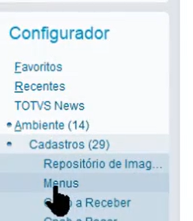
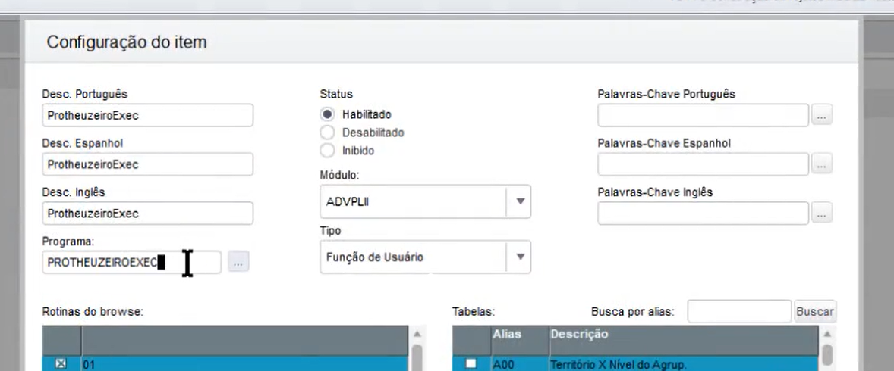

## Adicionar uma rotina em um Menu do Protheus

### Documentação - https://terminaldeinformacao.com/2023/05/31/como-adicionar-uma-rotina-em-um-menu-do-protheus/

---

### Ir no configurador - **CIGACFG**

-> Ambiente -> Cadastro -> Menu

{ width=220px }

---

### Ordem do passo a passo

1. Tira a seleção de todos, e marca o que quer mudar
2. Clica em **Adicioanr >>**
3. Seleciona a pasta que quer adicionar e clica em **Novo Item**
4. Preencha os campo
    - **Desc** = Nome do item no menu
    - **Módulo** = Escolhe qual vai ser adicionado
    - **Tipo** = Se for uma função de usuário, escolhe a de usuário
    - **Programa** = nome da função - **Se for de usuário não precisa do U_**
    - { width=620px }
> Tem os botões **Mover para cima** e **Mover para baixo**, para posicionar os itens corretamente no menu
5. Clicar em **Gerar**
    - Digitar o nome do módulo

 