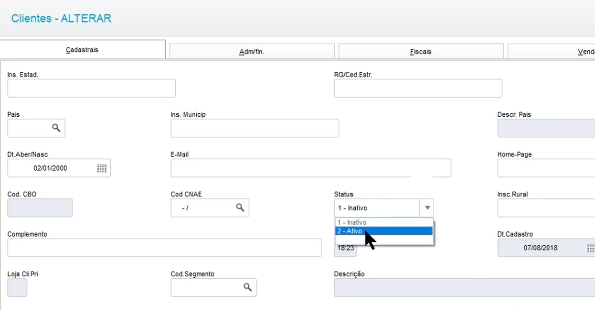
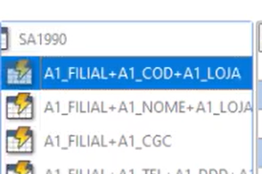

## Bloquear o cliente

### Deixar o cliente como inativo - sem ir no cadastro dele e colocar lá manualmente

{ width=620px }

---

### Campo do INATIVO - A1_MSBLQL

- 1 - Inativo
- 2 - Ativo

---

### Busca o cliente pelo índice de Filial + Código + Lola




```advpl
    DBSelectArea("SA1")
        // procura o cliente e a loja que está no get
    SA1->(DbSeek( xFilial("SA1")+cCod+cLoja ))
```

---

